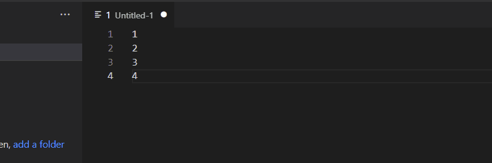

# sql-in-statements README

This is the README for the extension "sql-in-statements". I will go through and update this after I have been able to publish the extension!

# How To Use
1. Create a new editor window
2. Paste a list seperated by new lines
3. highlight the items in the list you want in the in statement
4. `Ctrl+Shift+P` to bring up the VSCode Command Palette
5. Type: `SQL IN() Statement`
6. Choose `with Quotes` or `without quotes`

**Enjoy!**
