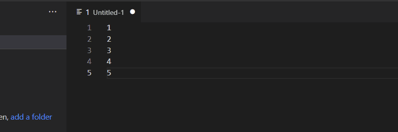

# List to SQL IN() Statement -  README:
One of the most frequent requests I get from stakeholders is to check the status of fifty-ish to a couple of thousand records in our DB. To do this, I am often faced with a choice:
1. either load the records into a table - which creates a one-time use table 
2. spend the time formatting a super long IN() statement

This extension allows you to paste a list from an Excel or CSV into a new editor window and activate the extension to create a new IN() statement.

## How To Use:
1. Create a new editor window
2. Paste a list seperated by new lines
3. highlight the items in the list you want in the in statement
4. `Ctrl+Shift+P` to bring up the VSCode Command Palette
5. Type: `SQL IN() Statement`
6. Choose `with Quotes` or `without quotes`

## Creating a IN() Statement with Quotes:

##  Creating a IN() Statement without Quotes:

## Connect with me:
https://www.linkedin.com/in/edward-charles-085025b1/

**Enjoy!**
